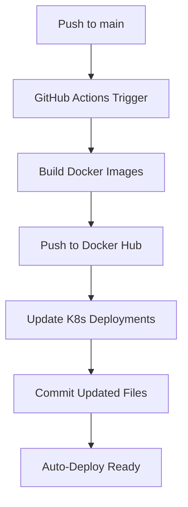

# InnerPeace - Meditation & Wellness Platform

[](https://github.com/AkhilMylaram/innerpeace/actions)
[](https://hub.docker.com/u/akhilmylaram)
[](https://kubernetes.io/)

A modern, cloud-native meditation and wellness platform built with Next.js, featuring personalized wellness tips, meditation resources, and a peaceful user experience.

## 🌟 Features

- **Personalized Dashboard**: Dynamic welcome messages with themed emojis
- **Health & Wellness Tips**: Random health tips with natural remedies and superfoods
- **Meditation Resources**: Curated meditation content and peaceful imagery
- **User Authentication**: Secure Firebase authentication
- **Responsive Design**: Mobile-first design with Tailwind CSS
- **Cloud-Native**: Containerized with Docker and Kubernetes-ready

## 🏗️ Architecture

### System Overview
```
┌─────────────────┐    ┌─────────────────┐    ┌─────────────────┐
│   GitHub Repo   │───▶│  GitHub Actions │───▶│   Docker Hub    │
│                 │    │   CI/CD Pipeline │    │   Image Registry│
└─────────────────┘    └─────────────────┘    └─────────────────┘
                                │
                                ▼
┌─────────────────┐    ┌─────────────────┐    ┌─────────────────┐
│  Kubernetes     │◀───│   Auto-Deploy   │    │   Kind Cluster  │
│  Deployments    │    │   Updates        │    │   (Local Dev)   │
└─────────────────┘    └─────────────────┘    └─────────────────┘
```

### Application Stack
```
┌─────────────────────────────────────────────────────────────┐
│                    Load Balancer (Nginx)                   │
│                     NodePort: 30003                        │
└─────────────────────┬───────────────────────────────────────┘
                      │
┌─────────────────────▼───────────────────────────────────────┐
│                Next.js Application                         │
│              NodePort: 30004                               │
│  ┌─────────────┐ ┌─────────────┐ ┌─────────────────────┐   │
│  │   Auth      │ │  Dashboard  │ │   Meditation        │   │
│  │  (Firebase) │ │  (Dynamic)  │ │   Resources         │   │
│  └─────────────┘ └─────────────┘ └─────────────────────┘   │
└─────────────────────────────────────────────────────────────┘
```

## 🚀 Quick Start

### Prerequisites
- Node.js 20+
- Docker & Docker Compose
- Kubernetes cluster (Kind for local development)
- kubectl CLI

### Local Development
```bash
# Clone the repository
git clone https://github.com/AkhilMylaram/innerpeace.git
cd innerpeace

# Install dependencies
npm install

# Start development server
npm run dev
```

### Docker Deployment
```bash
# Build and run with Docker Compose
docker-compose up --build

# Access the application
# Nginx: http://localhost:80
# App: http://localhost:3000
```

### Kubernetes Deployment
```bash
# Create Kind cluster
kind create cluster --name mycluster --config config.yml

# Deploy to Kubernetes
kubectl apply -f kubernetes/

# Access via NodePorts
# Nginx: http://localhost:30003
# App: http://localhost:30004
```

## 🔄 CI/CD Pipeline

### GitHub Actions Workflow


### Pipeline Features
- **Automated Builds**: Triggered on push to main branch
- **Image Tagging**: Timestamp + commit SHA for versioning
- **Auto-Updates**: Kubernetes deployment files updated automatically
- **Multi-Service**: Builds both app and nginx images
- **Security**: Uses GitHub secrets for Docker Hub authentication

### Workflow Configuration
```yaml
# Triggers
on:
  push:
    branches: [ main ]
  workflow_dispatch:

# Permissions
permissions:
  contents: write
  packages: write
```

## 📦 Container Images

### Available Images
- `akhilmylaram/innerpeace-app:latest` - Next.js application
- `akhilmylaram/innerpeace-nginx:latest` - Nginx reverse proxy

### Image Tagging Strategy
```
Format: YYYYMMDD-HHMMSS-{commit-sha}
Example: 20251224-130053-60ed489
```

## ☸️ Kubernetes Configuration

### Deployments
```yaml
# App Deployment
apiVersion: apps/v1
kind: Deployment
metadata:
  name: innerpeace-app
spec:
  replicas: 1
  selector:
    matchLabels:
      app: innerpeace-app
```

### Services & NodePorts
| Service | Port | NodePort | Purpose |
|---------|------|----------|---------|
| nginx-service | 80 | 30003 | Load balancer |
| innerpeace-service | 3000 | 30004 | Main application |

### Kind Cluster Configuration
```yaml
# config.yml
kind: Cluster
apiVersion: kind.x-k8s.io/v1alpha4
networking:
  apiServerAddress: "172.31.72.70"
  apiServerPort: 6443
nodes:
- role: control-plane
  extraPortMappings:
  - containerPort: 30003
    hostPort: 30003
- role: worker
  extraPortMappings:
  - containerPort: 30004
    hostPort: 30004
```

## 🛠️ Technology Stack

### Frontend
- **Framework**: Next.js 14 with TypeScript
- **Styling**: Tailwind CSS + shadcn/ui components
- **Authentication**: Firebase Auth
- **Database**: Firestore
- **State Management**: React hooks + Firebase hooks

### Backend & Infrastructure
- **Runtime**: Node.js 20 Alpine
- **Reverse Proxy**: Nginx
- **Containerization**: Docker
- **Orchestration**: Kubernetes
- **CI/CD**: GitHub Actions
- **Registry**: Docker Hub

### Development Tools
- **Package Manager**: npm
- **Linting**: ESLint + TypeScript
- **Build Tool**: Next.js built-in
- **Local Cluster**: Kind (Kubernetes in Docker)

## 📁 Project Structure

```
innerpeace/
├── src/
│   ├── app/
│   │   ├── (auth)/
│   │   │   ├── login/
│   │   │   └── signup/
│   │   ├── (protected)/
│   │   │   └── dashboard/
│   │   └── api/
│   ├── components/
│   │   └── ui/
│   ├── firebase/
│   └── lib/
├── docker/
│   └── nginx/
├── kubernetes/
│   ├── deployment.yaml
│   ├── nginx-deployment.yaml
│   ├── service.yaml
│   └── nginx-service.yaml
├── .github/
│   └── workflows/
│       └── main.yml
├── public/
├── Dockerfile
├── docker-compose.yml
├── config.yml (Kind cluster)
└── package.json
```

## 🔧 Configuration

### Environment Variables
```bash
# Firebase Configuration
NEXT_PUBLIC_FIREBASE_API_KEY=your_api_key
NEXT_PUBLIC_FIREBASE_AUTH_DOMAIN=your_domain
NEXT_PUBLIC_FIREBASE_PROJECT_ID=your_project_id

# Production Settings
NODE_ENV=production
PORT=3000
HOSTNAME=0.0.0.0
```

### Docker Hub Secrets
```bash
# Required GitHub Secrets
DOCKER_TOKEN=your_docker_hub_token
```

## 🚦 Health Checks & Monitoring

### Application Health
- **Nginx**: `/health` endpoint returns "healthy"
- **Next.js**: Root endpoint `/` for application status
- **Kubernetes**: Built-in readiness and liveness probes (removed for simplicity)

### Monitoring Endpoints
- Nginx Health: `http://localhost:30003/health`
- App Status: `http://localhost:30004/`

## 🔐 Security Features

- **Authentication**: Firebase secure authentication
- **HTTPS Ready**: Nginx configured for SSL termination
- **Container Security**: Non-root user in containers
- **Network Policies**: Kubernetes service isolation
- **Secret Management**: GitHub secrets for sensitive data

## 📈 Performance Optimizations

- **Multi-stage Builds**: Optimized Docker images
- **Static Assets**: Nginx serves static content
- **Caching**: Docker layer caching in CI/CD
- **Minimal Images**: Alpine Linux base images
- **Resource Limits**: Kubernetes resource management

## 🤝 Contributing

1. Fork the repository
2. Create a feature branch (`git checkout -b feature/amazing-feature`)
3. Commit your changes (`git commit -m 'Add amazing feature'`)
4. Push to the branch (`git push origin feature/amazing-feature`)
5. Open a Pull Request

## 📄 License

This project is licensed under the MIT License - see the [LICENSE](LICENSE) file for details.

## 🙏 Acknowledgments

- **Next.js Team** for the amazing framework
- **Firebase** for authentication and database services
- **Tailwind CSS** for the utility-first CSS framework
- **Kubernetes Community** for container orchestration
- **Docker** for containerization platform

---

**Built with ❤️ for inner peace and wellness**

For support or questions, please open an issue on GitHub.
